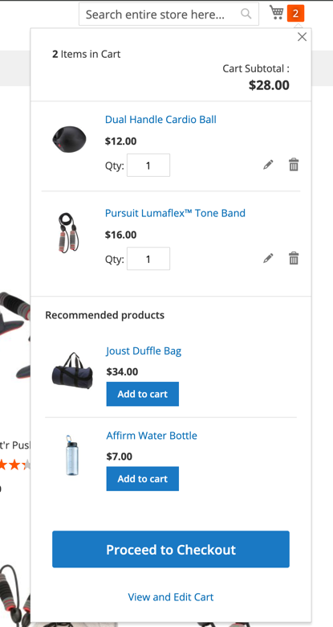

# Minicart Upsells
Module provides upsells in minicart.


## Version
`1.0.1`


## Installation

Add to composer:

```
"repositories": [
        {
            "type": "vcs",
            "url": "https://github.com/krzysiek0027/minicart_upsells"
        }
    ]
```

run:

```
$ composer require kw/module-minicart-upsells
```


## Technical Information
Module adds recommended products (upsell products from the product configuration) and places them in the minicart under the cart items. First products from upsell list. 
The section with upsell products is placed in the "extra_info" node in the minicart layout to avoid overwriting the entire minicart template what is more safe and easiest to maintain for future upgrades or other modules modified minicart.



## Requirements
The following versions of PHP are supported:


* PHP 7.4.x
* PHP 8.1.x


